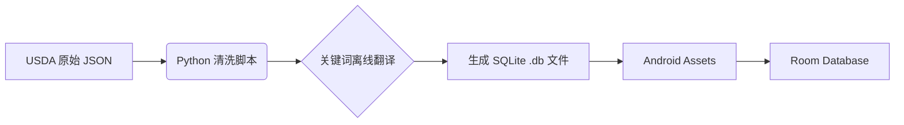

<div align="center">

# 🥑 FoodCalu (食物热量计算器)

[](https://www.android.com)
[](https://www.java.com)
[](https://developer.android.com/training/data-storage/room)
[](https://opensource.org/licenses/MIT)

**一个高性能、离线优先的 Android 营养摄入追踪应用。**
<br/>
内置 **450,000+** 条权威食物数据，支持毫秒级模糊搜索。

[功能特性](#-功能特性) • [技术栈](#-技术栈) • [数据处理流程](#-数据处理流程) • [安装指南](#-安装指南)

</div>

---

## 📱 项目简介 (Introduction)

**FoodCalu** 是一款专注于帮助用户精准记录每日热量和三大营养素（碳水、蛋白质、脂肪）的 Android 应用。

不同于市面上依赖网络的臃肿 App，本项目致力于提供 **纯本地、无延迟** 的使用体验。通过 Python 脚本对 USDA（美国农业部）权威数据进行清洗与中文化，内置了超过 45 万条基础及品牌食品数据，配合深度优化的搜索算法，确保用户能瞬间找到想要的食物。

## ✨ 功能特性 (Features)

* **🚀 海量离线数据库**：预置 `food_database.db`，包含 45 万+ 条食物数据，无需联网即可查询。
* **🔍 高性能搜索**：
    * 集成 **FTS (Full-Text Search)** 思想。
    * 实现 **防抖 (Debounce)** 机制，输入过程中不卡顿。
    * **异步线程池**处理查询，保证 UI 丝滑流畅。
* **📝 每日记录**：轻松记录早、中、晚餐及加餐，自动计算每日摄入总量。
* **🛠️ 自定义食物库**：支持用户 CRUD（增删改查）自定义食物，修正或补充数据库。
* **📊 营养分析**：实时展示热量、蛋白质、脂肪、碳水的摄入比例。

## 📸 界面预览 (Screenshots)

> *请在 `screenshots` 文件夹放入你的截图，并替换下方的链接*

| 首页概览 | 极速搜索 | 食物详情 | 添加记录 |
|:---:|:---:|:---:|:---:|
|  |  |  |  |

## 🛠 技术栈 (Tech Stack)

### Android 端
* **Language**: Java
* **Architecture**: MVVM / MVC Pattern (Activity + DAO)
* **Database**: [Android Room](https://developer.android.com/jetpack/androidx/releases/room) (SQLite ORM)
* **Concurrency**: `ExecutorService` (线程池), `Handler` (主线程通信)
* **UI Components**: `RecyclerView`, `CardView`, `Material Design`, `SearchView`

### 数据处理端 (Python ETL)
* **Data Source**: USDA FoodData Central & Survey Foods
* **Tools**: Python (`sqlite3`, `json`, `multiprocessing`)
* **Process**:
    1.  JSON 解析与清洗
    2.  多进程并行翻译 (English -> Chinese)
    3.  SQLite 数据库生成与预填充

## 🧬 数据处理流程 (Data Pipeline)

本项目的一大核心亮点是 **ETL 数据管线**。我们没有手动录入数据，而是构建了一套自动化脚本：



1. **Raw Data**: 获取 USDA `FoundationFoods` 及 `BrandedFoods`。
2. **Translation**: 使用 Python 脚本配合本地高频词典，将 "Chicken Breast, Raw" 转换为 "鸡胸肉 (生)"。
3. **Optimization**: 剔除冗余字段，仅保留核心营养素，将数据体积压缩至移动端可用大小。

## 📥 安装指南 (Installation)

1. **克隆项目**
```bash
git clone [https://github.com/YourUsername/FoodCalu.git](https://github.com/YourUsername/FoodCalu.git)

```


2. **导入 Android Studio**
* 打开 Android Studio -> File -> Open -> 选择项目根目录。


3. **同步 Gradle**
* 等待 Gradle Sync 完成，下载所需依赖。


4. **运行**
* 连接真机或模拟器 (建议 Android 7.0+)。
* 点击 **Run**。
* *注意：首次安装会自动将 Assets 中的数据库写入手机，大约需要 2-3 秒。*


## 🤝 贡献 (Contributing)

欢迎提交 Issue 或 Pull Request！
如果你有更好的数据源或翻译字典，请提交至 `python_scripts/` 目录。

## 📄 开源协议 (License)

[MIT License](https://www.google.com/search?q=LICENSE) © 2025 Your Name
